# 🧩 Puzzles Database

Όλοι οι γρίφοι με τις λύσεις τους, οργανωμένοι ανά χρονιά.

---

# 2020 - SAFARI 1

---

## Γρίφος #2

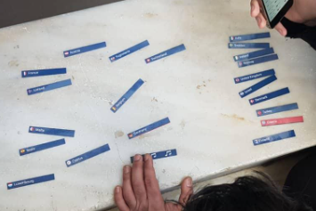

**Τι μας δίνουν:**
Καρτέλες με σημαίες χωρών που συμμετείχαν στη Eurovision. Μία χώρα είναι επισημασμένη με κόκκινο.

**Λογική επίλυσης:**

1. Googlάρουμε ποια χρονιά συμμετείχαν αυτές οι χώρες μαζί στη Eurovision → 1991
2. Η κόκκινη χώρα είναι η Ελλάδα → αυτή δίνει την απάντηση
3. Googlάρουμε "Ελλάδα Eurovision 1991" → τραγούδι "Άνοιξη" (Σοφία Βόσσου)

**Απάντηση:** Άνοιξη → Οδός Ανοίξεως (Νίκαια)

**Κατηγορία:** Logic + Trivia/Knowledge

---

## Γρίφος #3

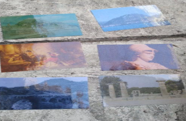

**Τι μας δίνουν:**
Ένα πορτοφόλι με 6 εικόνες μέσα - αρχαία αγάλματα, μνημεία και άλλα.

**Λογική επίλυσης:**

1. Μας δίνουν πορτοφόλι → σκεφτόμαστε χρήματα (παίζουμε Ελλάδα!)
2. Αναγνωρίζουμε ότι οι εικόνες είναι από χαρτονομίσματα δραχμών
3. Googlάρουμε τα χαρτονομίσματα δραχμών και βρίσκουμε ποιες αξίες υπάρχουν
4. Βλέπουμε ότι λείπει το 10.000 δραχμών
5. Googlάρουμε "10000 δραχμές χαρτονόμισμα" → απεικονίζεται ο Ασκληπιός

**Απάντηση:** Ασκληπιός → Οδός Ασκληπιού

**Κατηγορία:** Logic + Trivia/Knowledge

---

## Γρίφος #4


**Τι μας δίνουν:**
Ένα χαρτί με πυρσούς - κάποιοι αναμμένοι (ανοιχτοί) και κάποιοι σβηστοί (κλειστοί).

**Λογική επίλυσης:**

1. Googlάρουμε "Πυρσός cipher" → βρίσκουμε το Τετράγωνο του Πολυβίου
2. Οι πυρσοί δίνουν συντεταγμένες (γραμμή-στήλη)
3. Αποκωδικοποιούμε:
   - 3-2 → Μ
   - 1-1 → Α
   - 3-3 → Ν
   - 4-4 → Τ
   - 2-4 → Ι
   - 2-5 → Κ
   - 1-1 → Α
4. Αποτέλεσμα: ΜΑΝΤΙΚΑ

**Απάντηση:** Μαντικά → Οδός Μαντικά

**Κατηγορία:** Cipher (Polybius Square)

---

# 2020 - SAFARI 2

---

## Γρίφος #2

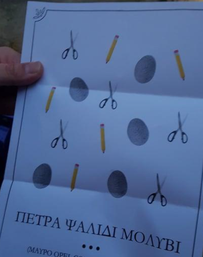

**Τι μας δίνουν:**
Μια εικόνα με 5 ψαλίδια, 5 μολύβια και 5 πέτρες. Από κάτω γράφει: ΠΕΤΡΑ ΨΑΛΙΔΙ ΜΟΛΥΒΙ.

**Λογική επίλυσης:**

1. Κοιτάμε τα σχήματα των αντικειμένων
2. Η πέτρα σχηματικά μοιάζει με το γράμμα **Ο**
3. Το ψαλίδι σχηματικά μοιάζει με το γράμμα **Χ**
4. Το μολύβι σχηματικά μοιάζει με το γράμμα **Ι**
5. ΠΕΤΡΑ ΨΑΛΙΔΙ ΜΟΛΥΒΙ → Ο Χ Ι → **ΟΧΙ**
6. ΟΧΙ → 28η Οκτωβρίου (που είπαμε το ΟΧΙ στους Ιταλούς)

**Απάντηση:** ΟΧΙ → Οδός 28ης Οκτωβρίου

**Κατηγορία:** Visual + Trivia/Knowledge

---

## Γρίφος #5

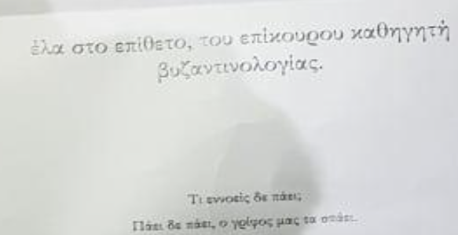

**Τι μας δίνουν:**
Ένα χαρτί με κείμενο:

> Στο τελωνείο τραλάρατα, τον Γιάγκο και την Βέρνα,
> και την Καβάλη γράψατε μέχρι και σε βετρίνα.
> Παντού μπροστά σας βλέπετε, σημαίες Πορτογαλίας.
>
> έλα στο επίθετο, του επίκουρου καθηγητή
> βυζαντινολογίας.
>
> Τι εννοείς δε πάει;
> Πάει δε πάει, ο γρίφος μας τα σπάει.

**Λογική επίλυσης:**

1. Διαβάζουμε προσεκτικά: "έλα στο επίθετο**,** του επίκουρου καθηγητή"
2. Το κόμμα είναι κλειδί! Αλλάζει το νόημα:
   - Χωρίς κόμμα: "έλα στο επίθετο του επίκουρου καθηγητή" = βρες το επώνυμο ενός καθηγητή
   - **Με κόμμα**: "έλα στο επίθετο, του επίκουρου" = η λέξη "επίκουρος" ΕΙΝΑΙ το επίθετο που ζητάμε
3. Η λέξη "επίκουρος" χρησιμοποιείται ως επίθετο (assistant professor)
4. Αλλά "Επίκουρος" είναι και το όνομα του αρχαίου φιλοσόφου → αυτή είναι η απάντηση

**Απάντηση:** Επίκουρος → Οδός Επικούρου

**Κατηγορία:** Wordplay

---

## Γρίφος #7

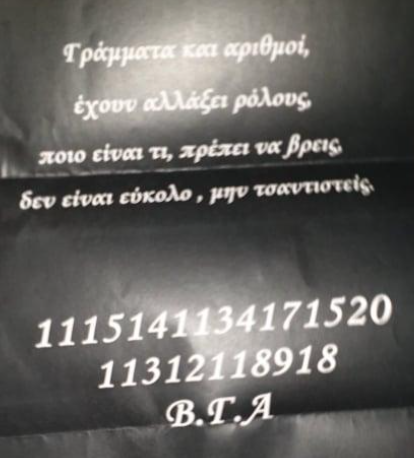

**Τι μας δίνουν:**
Ένα χαρτί με κείμενο:

> Γράμματα και αριθμοί,
> έχουν αλλάξει ρόλους,
> ποιο είναι τι, πρέπει να βρεις,
> δεν είναι εύκολο, μην τσαντιστείς.
>
> 11151411341715 20
> 113121189 18
> Β.Γ.Α

**Λογική επίλυσης:**

1. "Γράμματα και αριθμοί έχουν αλλάξει ρόλους" → αντιστροφή! Κάνε τα γράμματα αριθμούς
2. Β.Γ.Α → Β=2, Γ=3, Α=1 → **2.3.1**
3. **Δυσκολία:** Οι αριθμοί δεν έχουν κενά! Πώς τους χωρίζεις;
   - Το "11" είναι 11 (Λ) ή 1-1 (Α-Α);
   - Το "15" είναι 15 (Ο) ή 1-5 (Α-Ε);
   - **Hint:** Υπάρχει κενό μετά το "15 20" και "18" → αυτά είναι σίγουρα μονά νούμερα
4. Το 2.3.1 μοιάζει με παραπομπή κεφαλαίου βιβλίου (π.χ. Βίβλος)
5. Googlάρουμε "2.3.1 Μέγας Αλέξανδρος" ή ψάχνουμε ιστορικά κείμενα
6. Βρίσκουμε αναφορά στον **Γόρδιο Δεσμό** (ο Μέγας Αλέξανδρος τον έκοψε)

**Απάντηση:** Γόρδιος → Οδός Γορδίου

**Κατηγορία:** Cipher + Trivia/Knowledge

---

## Γρίφος #8

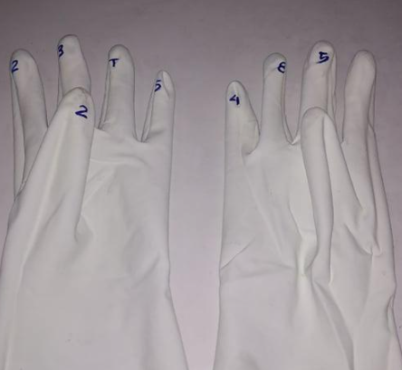

**Τι μας δίνουν:**
Δύο γάντια με νούμερα και γράμματα γραμμένα πάνω τους:
- Αριστερό γάντι: 2 2 3 Τ 5
- Δεξί γάντι: 4 8 5

Κάθε δάχτυλο έχει ένα νούμερο ή γράμμα.

**Λογική επίλυσης:**

1. Κάθε δάχτυλο αντιστοιχεί σε μια λέξη (τα ονόματα των δαχτύλων)
2. Ο αριθμός δείχνει ποιο γράμμα να πάρεις από το όνομα του δαχτύλου
3. Αριστερό χέρι:
   - Αντίχειρας (2) → **Ν**ΤΙΧΕΙΡΑΣ, 2ο γράμμα = **Ν**
   - Δείκτης (2) → Δ**Ε**ΙΚΤΗΣ, 2ο γράμμα = **Ε**
   - Μεσαίος (3) → ΜΕ**Σ**ΑΙΟΣ, 3ο γράμμα = **Σ**
   - Τ = απλά το γράμμα **Τ**
   - Μικρός (5) → ΜΙΚΡ**Ο**Σ, 5ο γράμμα = **Ο**
4. Δεξί χέρι:
   - (4) → 4ο γράμμα = **Ρ**
   - (8) → 8ο γράμμα = **Ο**
   - (5) → 5ο γράμμα = **Υ**
5. Αποτέλεσμα: **ΝΕΣΤΟΡΟΥ**

**Απάντηση:** Νεστόρου → Οδός Νεστόρου

**Κατηγορία:** Cipher + Wordplay

---

# 2021

---

## Γρίφος

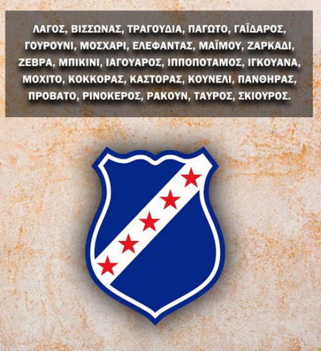

**Τι μας δίνουν:**
Ένα χαρτί με λίστα λέξεων και ένα έμβλημα ποδοσφαιρικής ομάδας:

> ΛΑΓΟΣ, ΒΙΣΩΝΑΣ, ΤΡΑΓΟΥΔΙΑ, ΠΑΓΩΤΟ, ΓΑΪΔΑΡΟΣ,
> ΓΟΥΡΟΥΝΙ, ΜΟΣΧΑΡΙ, ΕΛΕΦΑΝΤΑΣ, ΜΑΪΜΟΥ, ΖΑΡΚΑΔΙ,
> ΖΕΒΡΑ, ΜΠΙΚΙΝΙ, ΙΑΓΟΥΑΡΟΣ, ΙΠΠΟΠΟΤΑΜΟΣ, ΙΓΚΟΥΑΝΑ,
> ΜΟΧΙΤΟ, ΚΟΚΚΟΡΑΣ, ΚΑΣΤΟΡΑΣ, ΚΟΥΝΕΛΙ, ΠΑΝΘΗΡΑΣ,
> ΠΡΟΒΑΤΟ, ΡΙΝΟΚΕΡΟΣ, ΡΑΚΟΥΝ, ΤΑΥΡΟΣ, ΣΚΙΟΥΡΟΣ.

Και το έμβλημα της Καλλιθέας FC.

**Λογική επίλυσης:**

1. Οι περισσότερες λέξεις είναι ζώα, αλλά κάποιες **ξεχωρίζουν**
2. Βρίσκουμε τα "άκυρα": ΤΡΑΓΟΥΔΙΑ, ΠΑΓΩΤΟ, ΜΠΙΚΙΝΙ, ΜΟΧΙΤΟ
3. Googlάρουμε αυτές τις λέξεις μαζί → Είναι όλα τραγούδια του συγκροτήματος **KINGS**!
4. Googlάρουμε το έμβλημα → **Καλλιθέα FC**
5. Συνδυασμός: KINGS + Καλλιθέα → Καλλιθέα Cafe

**Verification:** "Πόσα και τι φυτά υπάρχουν στην μαύρη γλάστρα;" → Μικρή ελιά

**Απάντηση:** Καλλιθέα Cafe

**Κατηγορία:** Logic + Trivia/Knowledge

---

## Γρίφος #2: Sign Language ISBN

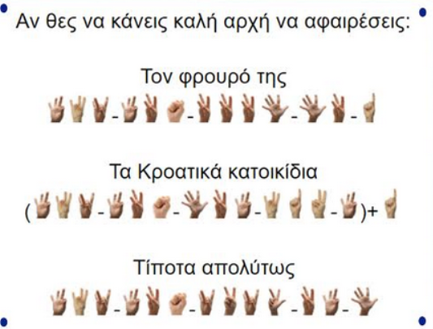

**Τι μας δίνουν:**
Ένα χαρτί με νοηματική γλώσσα (χέρια που δείχνουν αριθμούς) και κείμενο:

> Αν θες να κάνεις καλή αρχή να αφαιρέσεις:
>
> Τον φρουρό της [νοηματική: 978-960-6665-56-1]
>
> Τα Κροατικά κατοικίδια ([νοηματική: 978-960-569-712-9])+1
>
> Τίποτα απολύτως [νοηματική: 978-960-8283-69-5]

**Λογική επίλυσης:**

1. Αναγνωρίζουμε τη νοηματική γλώσσα → μεταφράζουμε σε αριθμούς
2. Οι αριθμοί είναι **ISBN** βιβλίων!
3. Googlάρουμε τα ISBN:
   - 978-960-6665-56-1 → "Φρουρός της **Πύλης**"
   - 978-960-569-712-9 → "101 Σκυλιά της Δαλματίας" (Κροατικά κατοικίδια!) → 101+1 = **102**
   - 978-960-8283-69-5 → "**Τρίκαλα**" (τίποτα = 0 = Τρί-καλά)
4. Συνδυασμός: **Πύλης 102 Τρίκαλα**

**Verification:** Όνομα μαγαζιού → ΑΛΙΕΝ

**Απάντηση:** Πύλης 102 Τρίκαλα

**Κατηγορία:** Cipher (Sign Language) + Trivia/Knowledge

---

## Γρίφος #3: Αντικείμενα σε Γράμματα

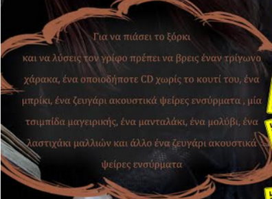

**Τι μας δίνουν:**
Κείμενο που περιγράφει αντικείμενα:

> Για να πιάσει το ξόρκι
> και να λύσεις τον γρίφο πρέπει να βρεις έναν τρίγωνο
> χάρακα, ένα οποιοδήποτε CD χωρίς το κουτί του, ένα
> μπρίκι, ένα ζευγάρι ακουστικά ψείρες ενσύρματα, μία
> τσιμπίδα μαγειρικής, ένα μανταλάκι, ένα μολύβι, ένα
> λαστιχάκι μαλλιών και άλλο ένα ζευγάρι ακουστικά
> ψείρες ενσύρματα

**Λογική επίλυσης:**

1. Κάθε αντικείμενο σχηματικά μοιάζει με ένα γράμμα
2. Αντιστοιχία αντικειμένων → γραμμάτων:
   - τρίγωνο χάρακα → **Δ** (τριγωνικό σχήμα)
   - CD → **Ο** (κυκλικό σχήμα)
   - μπρίκι → **Ρ** (το σώμα με τη λαβή)
   - ακουστικά ψείρες → **Υ** (σχήμα Υ με τα δύο ακουστικά)
   - τσιμπίδα μαγειρικής → **Λ** (ανοιχτή τσιμπίδα σε σχήμα Λ)
   - μανταλάκι → **Α** (σχήμα Α)
   - μολύβι → **Ι** (κάθετη γραμμή)
   - λαστιχάκι μαλλιών → **Ο** (κυκλικό)
   - ακουστικά ψείρες → **Υ**
3. Αποτέλεσμα: **ΔΟΡΥΛΑΙΟΥ**

**Απάντηση:** Δορυλαίου → Οδός Δορυλαίου (Νίκαια)

**Κατηγορία:** Visual (Σχηματική αναπαράσταση)

---

## Γρίφος #4: Αντικείμενα με Αριθμούς

**Τι μας δίνουν:**
Εικόνες αντικειμένων με αριθμούς δίπλα τους:

> ΚΕΡΙ - 1
> ΠΙΑΤΟ - 1
> ΠΙΡΟΥΝΙ - 7
> ΣΚΟΥΠΑ - 1
> ΓΟΥΡΟΥΝΙ - 7

**Λογική επίλυσης:**

1. Ο αριθμός δείχνει ποιο γράμμα να πάρεις από τη λέξη του αντικειμένου
2. Αντιστοιχία:
   - **Κ**ΕΡΙ (1ο γράμμα) → **Κ**
   - **Π**ΙΑΤΟ (1ο γράμμα) → **Π**
   - ΠΙΡΟΥΝ**Ι** (7ο γράμμα) → **Ι**
   - **Σ**ΚΟΥΠΑ (1ο γράμμα) → **Σ**
   - ΓΟΥΡΟΥ**Ν**Ι (7ο γράμμα) → **Ν**
3. Αποτέλεσμα: **ΚΠΙΣΝ**
4. Googlάρουμε "ΚΠΙΣΝ" → Κέντρο Πολιτισμού Ίδρυμα Σταύρος Νιάρχος

**Απάντηση:** ΚΠΙΣΝ → Κέντρο Πολιτισμού Ίδρυμα Σταύρος Νιάρχος (SNFCC)

**Κατηγορία:** Cipher (Position in Word) + Acronym

---

## Γρίφος #5: Σημαίες & Περιοδικός Πίνακας

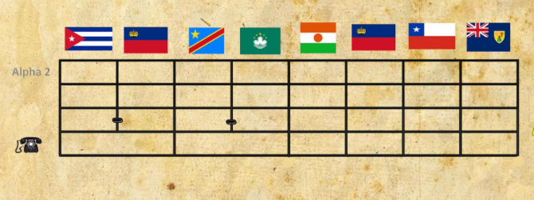

**Τι μας δίνουν:**
Σημαίες χωρών σε σειρά, με την ένδειξη "Alpha 2" και ένα εικονίδιο τηλεφώνου. Κάτω από τις σημαίες υπάρχει ένας πίνακας με κενά κελιά και σύμβολα +/- σε κάποια σημεία.

**Λογική επίλυσης:**

1. Αναγνωρίζουμε τις σημαίες και βρίσκουμε τους **ISO Alpha-2 κωδικούς** των χωρών:
   - Κούβα → **CU**
   - Λιχτενστάιν → **LI**
   - Κονγκό → **CG**
   - Μακάο → **MO**
   - Νίγηρας → **NE**
   - Λιχτενστάιν → **LI**
   - Χιλή → **CL**
   - Νησιά Τερκς και Κάικος → **TC**

2. Οι Alpha-2 κωδικοί είναι και **σύμβολα χημικών στοιχείων** στον περιοδικό πίνακα:
   - Cu (Χαλκός) = **29**
   - Li (Λίθιο) = **3**
   - Cg δεν υπάρχει, αλλά Cd (Κάδμιο) = **48**
   - Mo (Μολυβδαίνιο) = **42**
   - Ne (Νέον) = **10**
   - Li (Λίθιο) = **3**
   - Cl (Χλώριο) = **17**
   - Tc (Τεχνήτιο) = **43**

3. Εφαρμόζουμε τα +/- από τον πίνακα:
   - 29-3 = **26**
   - 48-42 = **6**
   - 10, 3, 17, 43

4. Τελικοί αριθμοί: **26 6 10 3 17 43**

5. Το τηλέφωνο υποδεικνύει τηλεφωνικούς κωδικούς χωρών:
   - +26 → Κ (Κένυα περιοχή)
   - Ή αριθμοί → γράμματα αλφαβήτου

6. Googlάρουμε → **Κανόνι Καφέ Κέρκυρα**

**Απάντηση:** Κανόνι Καφέ Κέρκυρα

**Κατηγορία:** Cipher (ISO Codes + Periodic Table) + Trivia/Knowledge

---

## Γρίφος #6: Μετρό Αθήνας

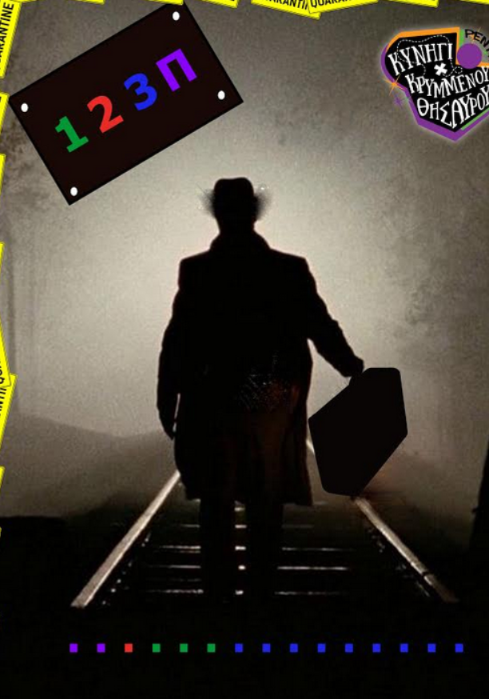

**Τι μας δίνουν:**
Μια εικόνα με άνδρα που περπατάει σε σιδηροδρομικές γραμμές (hint για Μετρό/τρένο!), με:
- Πινακίδα που γράφει "1 2 3 Π" με διαφορετικά χρώματα (κόκκινο, μπλε, πράσινο, μωβ)
- Κάτω μια σειρά από χρωματιστά τετράγωνα: μωβ, μωβ, κόκκινο, πράσινο, πράσινο, πράσινο, μπλε, μπλε, μπλε, μπλε, μπλε, μπλε, μπλε, μπλε, μπλε

**Λογική επίλυσης:**

1. Ο άνδρας στις ράγες μας υποδεικνύει ότι πρόκειται για **Μετρό/τρένο**
2. Τα χρώματα αντιστοιχούν στις **γραμμές του Μετρό Αθήνας** και τον **Προαστιακό**:
   - Μωβ = **Προαστιακός** (Π)
   - Κόκκινο = **Γραμμή 2**
   - Πράσινο = **Γραμμή 1** (ΗΣΑΠ)
   - Μπλε = **Γραμμή 3**

3. Μετράμε τα τετράγωνα = **στάσεις**:
   - 2 μωβ = 2 στάσεις Προαστιακός
   - 1 κόκκινο = 1 στάση Γραμμή 2
   - 3 πράσινα = 3 στάσεις Γραμμή 1
   - 9 μπλε = 9 στάσεις Γραμμή 3

4. Ξεκινάμε από **Ρέντη** (Προαστιακός):
   - Ρέντη → 2 στάσεις Προαστιακός → Ταύρος
   - Αλλαγή σε κόκκινη → 1 στάση → Μεταξουργείο
   - Αλλαγή σε πράσινη → 3 στάσεις → Μοναστηράκι
   - Αλλαγή σε μπλε → 9 στάσεις → **Νομισματοκοπείο**

5. Η απάντηση είναι το **Νομισματοκοπείο** → πρέπει να μετρήσουμε τα τετράγωνα της πυραμίδας στον σταθμό

**Απάντηση:** Νομισματοκοπείο (Μετρό) - μέτρησε τα τετράγωνα της πυραμίδας

**Κατηγορία:** Logic + Map/Navigation

---

## Γρίφος #7: Semaphore Flag Clock

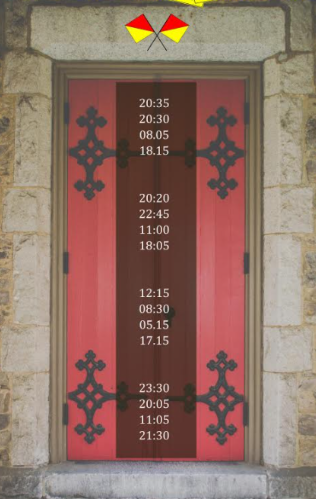

**Τι μας δίνουν:**
Μια κόκκινη πόρτα με δύο σημαίες (κόκκινη-κίτρινη) στην κορυφή και 4 ομάδες ωρών:

> **Ομάδα 1:** 20:35, 20:30, 08:05, 18:15
> **Ομάδα 2:** 20:20, 22:45, 11:00, 18:05
> **Ομάδα 3:** 12:15, 08:30, 05:15, 17:15
> **Ομάδα 4:** 23:30, 20:05, 11:05, 21:30

**Λογική επίλυσης:**

1. Οι σημαίες στην κορυφή είναι **hint** → Googlάρουμε "flag cipher" → **Semaphore Flag Cipher**
2. Στο Semaphore, οι θέσεις των σημαιών μοιάζουν με δείκτες ρολογιού
3. Κάθε ώρα = ένα γράμμα, όπου οι δύο δείκτες (ώρα + λεπτά) δείχνουν τις θέσεις των δύο σημαιών
4. Αποκωδικοποιούμε κάθε ομάδα:
   - Ομάδα 1 → **HALF**
   - Ομάδα 2 → **NOTE**
   - Ομάδα 3 → **JAZZ**
   - Ομάδα 4 → **CLUB**
5. Αποτέλεσμα: **HALF NOTE JAZZ CLUB**

**Απάντηση:** Half Note Jazz Club (γνωστό jazz club στην Αθήνα)

**Κατηγορία:** Cipher (Semaphore Flag) + Clock Positions

---

## Γρίφος #8: Vigenère Cipher

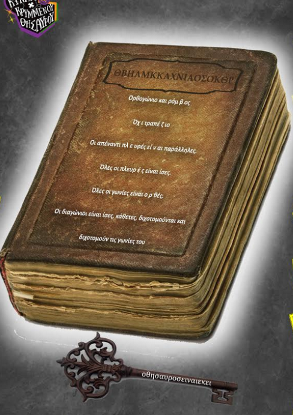

**Τι μας δίνουν:**
Μια εικόνα με:
- Ένα βιβλίο
- Ένα κρυπτογραφημένο κείμενο με περίεργα γράμματα
- Ένα κλειδί με τη λέξη **ΟΘΗΣΑΥΡΟΣΕΙΝΑΙΕΚΕΙ**

Κρυπτογραφημένο κείμενο: **ΘΒΗΑΜΚΚΑΧΝΙΑΟΣΟΚΘΡ**

**Λογική επίλυσης:**

1. Βλέπουμε βιβλίο + κλειδί + περίεργα γράμματα → υποψιαζόμαστε cipher με keyword
2. Googlάρουμε "cipher with key book" → βρίσκουμε **Vigenère Cipher**
3. Στο Vigenère, κάθε γράμμα του κειμένου αποκρυπτογραφείται με το αντίστοιχο γράμμα του κλειδιού
4. Εφαρμόζουμε αποκρυπτογράφηση Vigenère:
   - Κείμενο: ΘΒΗΑΜΚΚΑΧΝΙΑΟΣΟΚΘΡ
   - Κλειδί: ΟΘΗΣΑΥΡΟΣΕΙΝΑΙΕΚΕΙ
   - Αποτέλεσμα: **ΣΤΑΘΜΟΣΛΕΙΑΝΟΚΛΑΔΙ**
5. Χωρίζουμε: **ΣΤΑΘΜΟΣ ΛΕΙΑΝΟΚΛΑΔΙ**

**Απάντηση:** Σταθμός Λειανοκλάδι (σιδηροδρομικός σταθμός)

**Κατηγορία:** Cipher (Vigenère)

---

## Γρίφος #9: Βελάκια (Darts)

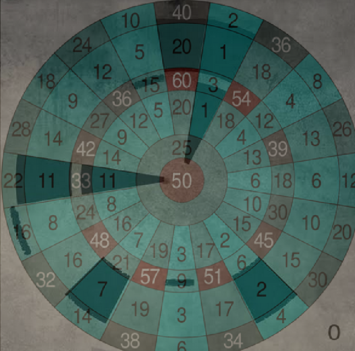

**Τι μας δίνουν:**
Ένας πίνακας βελάκια (dartboard) με βελάκια καρφωμένα σε διάφορα σημεία.

**Λογική επίλυσης:**

1. Κοιτάμε πού έχουν πέσει τα βελάκια στον πίνακα
2. Κάθε θέση στον πίνακα αντιστοιχεί σε έναν αριθμό (1-20)
3. Καταγράφουμε τους αριθμούς με τη σειρά που πέφτουν τα βελάκια:
   - **16, 1, 11, 9, 1, 2, 15, 20, 11, 7**
4. Μετατρέπουμε αριθμούς → γράμματα (1=Α, 2=Β, 3=Γ...):
   - 16 = **Π**
   - 1 = **Α**
   - 11 = **Λ**
   - 9 = **Ι**
   - 1 = **Α**
   - 2 = **Β**
   - 15 = **Ο**
   - 20 = **Υ**
   - 11 = **Λ**
   - 7 = **Η**
5. Αποτέλεσμα: **ΠΑΛΙΑ ΒΟΥΛΗ**

**Απάντηση:** Παλιά Βουλή (κτίριο στην Αθήνα - Εθνικό Ιστορικό Μουσείο)

**Κατηγορία:** Visual + Cipher (Numbers to Letters)

---

# 2022

---

## Γρίφος #1: Πυραμίδα & Μήνυμα σε Μπουκάλι

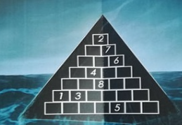

**Τι μας δίνουν:**
Ένα μπουκάλι με μήνυμα που γράφει:
> "Ο ΚΡΥΦΟΣ ΣΑΣ ΜΑΘΗΤΗΣ ΘΑ ΔΩΣΕΙ ΛΥΣΗ"

Και μια πυραμίδα με αριθμούς τοποθετημένους σε συγκεκριμένες θέσεις (7 σειρές, οι αριθμοί δείχνουν τη θέση του γράμματος):
```
      2
     _ 7
    _ _ 6
   _ 4 _ _
  _ _ 8 _ _
 1 3 _ _ _ _
_ _ _ _ 5 _ _
```

**Λογική επίλυσης:**

1. Οι αριθμοί 1-8 στην πυραμίδα **σε σειρά** υποδεικνύουν ότι η θέση τους καθορίζει τη **σειρά ανάγνωσης**
2. Ταξινομούμε τις λέξεις κατά **αριθμό χαρακτήρων**:
   - 1 χαρακτήρας → **Ο**
   - 2 χαρακτήρες → **ΘΑ**
   - 3 χαρακτήρες → **ΣΑΣ**
   - 4 χαρακτήρες → **ΛΥΣΗ**
   - 5 χαρακτήρες → **ΔΩΣΕΙ**
   - 6 χαρακτήρες → **ΚΡΥΦΟΣ**
   - 7 χαρακτήρες → **ΜΑΘΗΤΗΣ**

3. Κάθε **σειρά της πυραμίδας** αντιστοιχεί σε μία **λέξη** (σειρά 1 = λέξη με 1 χαρ, σειρά 2 = λέξη με 2 χαρ, κλπ)
4. Ο **αριθμός** δείχνει τη **σειρά ανάγνωσης** (1ος, 2ος, 3ος... χαρακτήρας του αποτελέσματος)
5. Η **θέση του αριθμού** στη σειρά δείχνει **ποιο γράμμα** να πάρουμε από τη λέξη

6. Αποκωδικοποίηση:
   - Σειρά 1 (Ο): αριθμός 2 στη θέση 1 → **Κ** (1ο γράμμα, 2ος στη σειρά)
   - Σειρά 2 (ΘΑ): αριθμός 7 στη θέση 2 → **Α** (2ο γράμμα, 7ος στη σειρά)
   - Σειρά 3 (ΣΑΣ): αριθμός 6 στη θέση 3 → **Σ** (3ο γράμμα, 6ος στη σειρά)
   - Σειρά 4 (ΛΥΣΗ): αριθμός 4 στη θέση 2 → **Υ** (2ο γράμμα, 4ος στη σειρά)
   - Σειρά 5 (ΔΩΣΕΙ): αριθμός 8 στη θέση 3 → **Σ** (3ο γράμμα, 8ος στη σειρά)
   - Σειρά 6 (ΚΡΥΦΟΣ): αριθμοί 1,3 στις θέσεις 1,2 → **Κ** (1ο), **Ρ** (2ο) (1ος και 3ος στη σειρά)
   - Σειρά 7 (ΜΑΘΗΤΗΣ): αριθμός 5 στη θέση 5 → **Τ** (5ο γράμμα, 5ος στη σειρά)

7. Βάζουμε τα γράμματα με τη σειρά 1-8: **Κ-Ο-Ρ-Υ-Τ-Σ-Α-Σ** = **ΚΟΡΥΤΣΑΣ**

**Απάντηση:** Οδός Κορύτσας

**Κατηγορία:** Logic + Wordplay (Word Length Sorting)

---

## Γρίφος #2: Δεκαεξαδικό Χρώμα

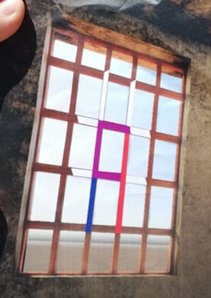

**Τι μας δίνουν:**
Ένα παράθυρο με κάγκελα (grid) και χρωματιστές γραμμές:
- Μωβ γραμμή (οριζόντια)
- Κόκκινη γραμμή (κάθετη)
- Μπλε γραμμή (κάθετη)

Το μωβ είναι συνδυασμός μπλε + κόκκινου.

**Λογική επίλυσης:**

1. **Αναγνώριση:** Το κάγκελο (#) μας υποδεικνύει **δεκαεξαδικό κώδικα χρώματος** (hex color code)

2. **Ανάλυση σχημάτων:**
   - Το μπλε μαζί με το μωβ (μπλε+κόκκινο) σχηματίζει το γράμμα **F**
   - Το κόκκινο σχηματίζει τον αριθμό **9**

3. **Σειρά ανάγνωσης:** Μπλε-Μπλε-Μπλε-Κόκκινο-Κόκκινο
   - Hex format: **#FFFF99**

4. **Αποκωδικοποίηση:** Googlάρουμε "#FFFF99 color name"
   - Το #FFFF99 είναι το χρώμα **Canary** (κίτρινο καναρίνι)

5. **Canary** → Καναρίνι → **Κανάρης**

**Απάντηση:** Οδός Κανάρη

**Κατηγορία:** Visual + Cipher (Hexadecimal Color Code)

---

## Γρίφος #8: Δορυφόροι του Πλούτωνα

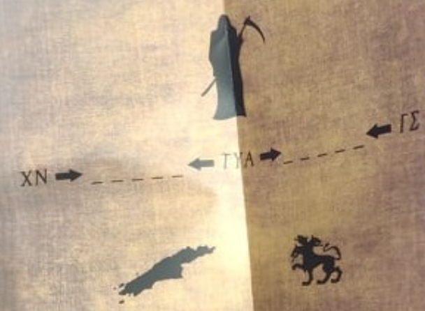

**Τι μας δίνουν:**
Δύο εικόνες:

**Εικόνα 1:** Ένα ύφασμα/χάρτης με:
- Χάρων (φιγούρα με δρεπάνι)
- Ύδρα (νησί σχήμα)
- Κέρβερος (σκύλος με πολλά κεφάλια)
- Βέλη με γράμματα: ΧΝ → ΤΥΑ → ΓΣ

**Εικόνα 2:** 5 αρχαίοι Έλληνες στρατιώτες με δόρατα και ασπίδες (Σπαρτιάτες/Δωριείς)

**Λογική επίλυσης:**

1. **Αναγραμματισμός των γραμμάτων:**
   - ΧΝ → **ΝΥΧΤΑ** (ή μέρος της)
   - ΤΥΑ + ΓΣ → **ΣΤΥΓΑ** (ποταμός του Άδη)

2. **Αναγνώριση εικόνων - Ελληνική μυθολογία:**
   - Χάρων = ο πορθμέας του Άδη
   - Ύδρα = το τέρας (ή το νησί)
   - Κέρβερος = ο σκύλος του Άδη
   - Στύγα = ο ποταμός του Άδη
   - Νύχτα = η θεά

3. **Λογοπαίγνιο με τους στρατιώτες:**
   - 5 στρατιώτες που **φέρουν δόρια** (κρατάνε δόρατα)
   - "Φέρουν δόρια" = **ΔΟΡΥΦΟΡΟΙ**

4. **Σύνδεση:**
   - Χάρων, Ύδρα, Κέρβερος, Στύγα, Νύχτα = όλα είναι **ΔΟΡΥΦΟΡΟΙ ΤΟΥ ΠΛΟΥΤΩΝΑ**!
   - Ο Πλούτωνας (νάνος πλανήτης) έχει 5 δορυφόρους με αυτά τα ονόματα

**Απάντηση:** Πλούτωνας (ή Δορυφόροι)

**Κατηγορία:** Wordplay + Logic + Trivia/Knowledge (Αστρονομία)

---

# 2023 - SAFARI 1

---

## Γρίφος #5: Sudoku - Μην το λύσεις!

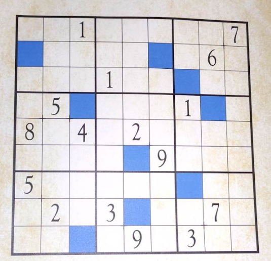

**Τι μας δίνουν:**
Ένα Sudoku 9x9 με μπλε τετράγωνα διάσπαρτα και κάποιους αριθμούς. Κάτω γράφει:
> "Μην το λύσεις, θα την πατήσεις!"

**Λογική επίλυσης:**

1. **"Μην το λύσεις"** = ΔΕΝ λύνουμε το Sudoku! Η λύση κρύβεται αλλού.

2. **"Θα την πατήσεις"** = τα μπλε τετράγωνα είναι αυτά που "πατάμε"

3. Υπάρχουν **9 μπλε τετράγωνα** = 9 γράμματα (ΚΑΡΑΜΑΝΛΗ έχει 9 γράμματα!)

4. **Κάθε μπλε τετράγωνο** δίνει τη σειρά ανάγνωσης (1-9) ανάλογα με τη θέση του μέσα στο **3x3 box** του Sudoku:
   ```
   1 2 3
   4 5 6
   7 8 9
   ```

5. Για κάθε μπλε τετράγωνο:
   - Βρίσκουμε σε ποιο 3x3 box ανήκει
   - Η θέση του μέσα στο 3x3 δίνει τη **σειρά ανάγνωσης** (1ο, 2ο, ... 9ο γράμμα)
   - Προσθέτουμε τους αριθμούς που υπάρχουν σε αυτό το 3x3 box
   - Το άθροισμα → γράμμα (1=Α, 2=Β, ... 10=Ι, 11=Κ, 12=Λ, 13=Μ, 14=Ν, κλπ)

6. **Αναλυτική αποκωδικοποίηση:**
   - Μπλε στη θέση **1** του 3x3 → άθροισμα αριθμών = 7+3 = **10** → **Κ** (1ο γράμμα)
   - Μπλε στη θέση **2** του 3x3 → άθροισμα = **1** → **Α** (2ο γράμμα)
   - Μπλε στη θέση **3** του 3x3 → άθροισμα = **17** → **Ρ** (3ο γράμμα)
   - Μπλε στη θέση **4** του 3x3 → άθροισμα = **1** → **Α** (4ο γράμμα)
   - Μπλε στη θέση **5** του 3x3 → άθροισμα = **13** → **Μ** (5ο γράμμα)
   - Μπλε στη θέση **6** του 3x3 → άθροισμα = **1** → **Α** (6ο γράμμα)
   - Μπλε στη θέση **7** του 3x3 → άθροισμα = **14** → **Ν** (7ο γράμμα)
   - Μπλε στη θέση **8** του 3x3 → άθροισμα = **12** → **Λ** (8ο γράμμα)
   - Μπλε στη θέση **9** του 3x3 → άθροισμα = **8** → **Η** (9ο γράμμα)

7. Τα 9 γράμματα με τη σειρά 1-9 δίνουν: **Κ-Α-Ρ-Α-Μ-Α-Ν-Λ-Η** = **ΚΑΡΑΜΑΝΛΗ**

**Απάντηση:** Οδός Καραμανλή

**Κατηγορία:** Logic + Visual + Cipher (Sudoku Grid Position + Numbers to Letters)

---

## Γρίφος #6: Amazon YouTube Cipher

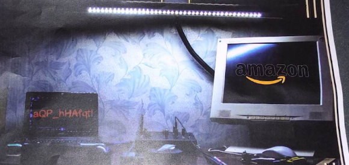

**Τι μας δίνουν:**
Μια οθόνη υπολογιστή με:
- Το λογότυπο της **Amazon** (με το βελάκι a→z)
- Ένα κρυπτογραφημένο κείμενο: **aQP_hHafqtl**

**Λογική επίλυσης:**

1. **Αναγνώριση μορφής:**
   - Το κείμενο έχει **11 χαρακτήρες** → τυπικό μήκος YouTube Video ID
   - YouTube URLs: `youtube.com/watch?v=[11 χαρακτήρες]`

2. **Αναγνώριση cipher:**
   - Το λογότυπο Amazon έχει βελάκι **a→z** (από το a στο z)
   - Αυτό υποδεικνύει **Caesar Cipher** με shift -1 (κάθε γράμμα πάει ένα πίσω)

3. **Αποκωδικοποίηση με Caesar (shift -1):**
   - a → z
   - Q → P
   - P → O
   - _ → _ (μένει)
   - h → g
   - H → G
   - a → z
   - f → e
   - q → p
   - t → s
   - l → k

4. **Αποτέλεσμα:** `zPO_gGzepsk`

5. **YouTube URL:** `youtube.com/watch?v=zPO_gGzepsk`

6. **Googláρουμε** το video ID → Το βίντεο είναι το τραγούδι **"Γιορτάζω"**

7. **Τελική λύση:** Σκεφτόμαστε "ποιος γιορτάζει σήμερα;" → η απάντηση εξαρτάται από την ημερομηνία του κυνηγιού

**Απάντηση:** Γιορτάζω → [Όνομα αγίου που γιορτάζει εκείνη την ημέρα]

**Κατηγορία:** Cipher (Caesar) + Trivia/Knowledge (YouTube + Εορτολόγιο)

---

# 2023 - SAFARI 2

---

## Γρίφος #1: Τράπουλα & Τηλέφωνο

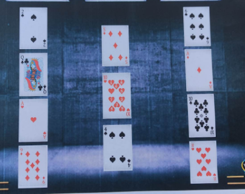

**Τι μας δίνουν:**
- 3 στήλες με κάρτες τράπουλας τοποθετημένες σε διάφορες θέσεις
- Μια κάρτα **10 καρδιά** που δείχνει τη σειρά ανάγνωσης των θέσεων (1→6→8→5→7→2→4→3→9)

**Λογική επίλυσης:**

1. **Κλειδί:** Η κάρτα 10 καρδιά δείχνει τη **σειρά ανάγνωσης** - τα νούμερα μέσα στις καρδιές υποδεικνύουν ποια θέση διαβάζεται πρώτη, δεύτερη, κλπ.

2. **Εφαρμογή:** Χρησιμοποιούμε αυτή τη διάταξη για να διαβάσουμε τους αριθμούς από τις κάρτες με τη σωστή σειρά

3. **Αποτέλεσμα:** Οι αριθμοί που προκύπτουν είναι: **2104915168**

4. **Google Search:** Ψάχνουμε "2104915168" → Είναι το τηλέφωνο του **10ου Δημοτικού Σχολείου Νίκαιας**

**Απάντηση:** 10ο Δημοτικό Σχολείο Νίκαιας

**Κατηγορία:** Visual + Logic + Trivia/Knowledge (Τηλεφωνικός αριθμός)

---

## Γρίφος #2: Ανάποδα Κορακίστικα & Village

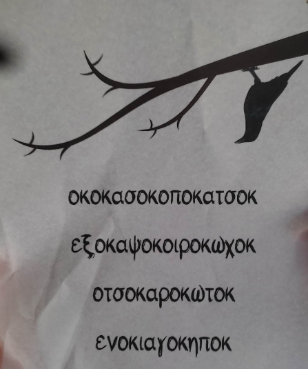

**Τι μας δίνουν:**
- Ένα κλαδί με **κοράκι/νυχτερίδα κρεμασμένο ανάποδα**
- 4 σειρές με περίεργα ελληνικά γράμματα:
  - ΟΚΟΚΑΣΟΚΟΠΟΚΑΤΣΟΚ
  - ΕΞΟΚΑΨΟΚΟΙΡΟΚΩΧΟΚ
  - ΟΤΣΟΚΑΡΟΚΩΤΟΚ
  - ΕΝΟΚΙΑΥΟΚΗΠΟΚ

**Λογική επίλυσης:**

1. **Αναγνώριση:** Το κοράκι είναι **ανάποδα** = hint ότι πρόκειται για **ανάποδα κορακίστικα**!

2. **Τι είναι τα κορακίστικα:** Στα κανονικά κορακίστικα, προσθέτουμε "ΚΟ" πριν από κάθε συλλαβή. Στα **ανάποδα** κορακίστικα, προσθέτουμε "ΟΚ" **μετά** από κάθε συλλαβή.

3. **Αποκωδικοποίηση:** Αφαιρούμε το "ΟΚ" μετά από κάθε συλλαβή:
   - ΟΚΟΚΑΣΟΚΟΠΟΚΑΤΣΟΚ → **Ο ΚΑ ΣΟ ΠΑ ΤΣ** → **ΠΗΓΑΙΝΕ**
   - (και οι υπόλοιπες σειρές)

4. **Μήνυμα:** "**ΠΗΓΑΙΝΕ ΣΤΟ ΧΩΡΙΟ**"

5. **Χωριό = Village** (απλή μετάφραση) → **Village θέατρο/κινηματογράφος**

6. **Μέτρα τα "ΚΟ":** Μετράμε πόσα "ΟΚ" υπάρχουν συνολικά = **15**

7. **Τελική λύση:** Πηγαίνουμε στο Village και βλέπουμε ποια ταινία παίζεται στην **αίθουσα 15**

**Απάντηση:** Ταινία Αργοναυτών (η ταινία που παιζόταν στην αίθουσα 15 του Village)

**Κατηγορία:** Cipher (Κορακίστικα) + Wordplay + Real-world interaction

---

## Γρίφος #3: Νόμος Καλλικράτη & Χάρτης Περιφερειακής Ενότητας

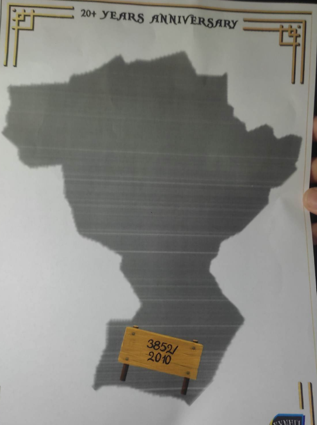

**Τι μας δίνουν:**
- Ένα γκρι σχήμα που είναι **περίγραμμα περιφερειακής ενότητας** (πρώην νομού)
- Μια ξύλινη πινακίδα με τον αριθμό **3852/2010**

**Λογική επίλυσης:**

1. **Αναγνώριση αριθμού:** Το 3852/2010 είναι αριθμός νόμου → Googlάρουμε

2. **Google Search:** "3852/2010" → Είναι ο **Νόμος Καλλικράτης** (νέα αρχιτεκτονική αυτοδιοίκησης - οι νομοί έγιναν **περιφερειακές ενότητες**)

3. **Hint:** Ο νόμος Καλλικράτης δημιούργησε **74 περιφερειακές ενότητες** → το σχήμα είναι χάρτης περιφερειακής ενότητας!

4. **Αναγνώριση σχήματος:** Συγκρίνουμε το σχήμα με χάρτες ελληνικών περιφερειακών ενοτήτων → Μοιάζει με την **Περιφερειακή Ενότητα Λασιθίου** (ανατολική Κρήτη)

5. **Έλεγχος:** Υπάρχει **Οδός Λασιθίου** στη Νίκαια/Ρέντη; → ΝΑΙ!

**Απάντηση:** Οδός Λασιθίου

**Κατηγορία:** Trivia/Knowledge (Νομοθεσία + Γεωγραφία)

---

## Γρίφος #4: WiFi & Λεωφορείο 800

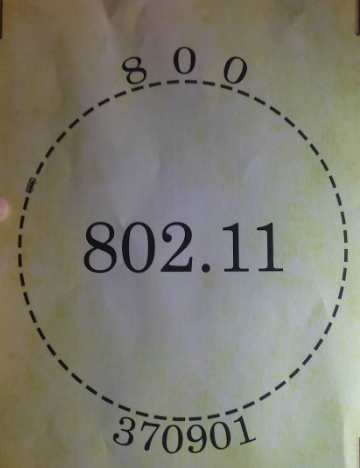

**Τι μας δίνουν:**
- Ένας κύκλος με διακεκομμένη γραμμή (σαν σήμα WiFi)
- Στο κέντρο: **802.11**
- Πάνω: **8 0 0** (με κενά)
- Κάτω: **370901**

**Λογική επίλυσης:**

1. **Αναγνώριση 802.11:** Είναι το πρότυπο **WiFi** (IEEE 802.11)

2. **Αναγνώριση 800:** Είναι η **γραμμή λεωφορείου 800** (βλέπουμε και μικρό λεωφορείο στην εικόνα)

3. **Αριθμός 370901:** Είναι ο **κωδικός στάσης** στη διαδρομή του 800

4. **Οδηγίες:**
   - Πας στη στάση 370901 της γραμμής 800
   - Ψάχνεις για **WiFi δίκτυο** (hint: 802.11)
   - Συνδέεσαι στο WiFi
   - Βλέπεις τον **επόμενο σταθμό/γρίφο**

5. **Τοποθεσία:** Η στάση είναι κοντά στο **Δημαρχείο**

**Απάντηση:** Στάση λεωφορείου 800 - σύνδεση σε WiFi για επόμενο γρίφο

**Κατηγορία:** Trivia/Knowledge (Τεχνολογία + ΟΑΣΑ) + Real-world interaction

---

## Γρίφος #5: Γράμμα από τον Κάπτεν Νίρεν

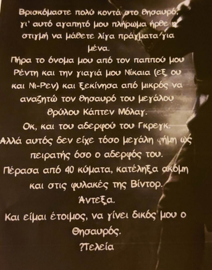

**Τι μας δίνουν:**
Ένα "γράμμα" από τον Κάπτεν Νίρεν με κείμενο:

> Βρισκόμαστε πολύ κοντά στο θησαυρό, γι' αυτό αγαπητό μου πλήρωμα ήρθε η στιγμή να μάθετε λίγα πράγματα για μένα**.**
> Πήρα το όνομα μου από τον παππού μου Ρέντη και την γιαγιά μου Νίκαια (εξ ου και Νι-Ρεν) και ξεκίνησα από μικρός να αναζητώ τον θησαυρό του μεγάλου θρύλου Κάπτεν Μόλα**γ.**
> Οκ, και του αδερφού του Γκρεγκ. Αλλά αυτός δεν είχε τόσο μεγάλη φήμη ως πειρατής όσο ο αδερφός του**.**
> Πέρασα από 40 κύματα, κατέληξα ακόμη και στις φυλακές της Βίντορ**.**
> Άντεξα**.**
> Και είμαι έτοιμος, να γίνει δικός μου ο Θησαυρός**.**
> **?Πελεία**

**Λογική επίλυσης:**

1. **Hint στο τέλος:** "?Πελεία" = **Τελεία** (με το ? μπροστά να υποδεικνύει ερώτηση/αναζήτηση)

2. **Μέθοδος:** Παίρνουμε το γράμμα **πριν από κάθε τελεία (.)**:
   - μέν**α.** → **Α**
   - Μόλα**γ.** → **Γ**
   - του**. → **Υ** (του αδερφού του)
   - Βίντο**ρ.** → **Ρ**
   - Άντεξ**α.** → **Α**
   - Θησαυρό**ς.** → **Σ**

3. **Αποτέλεσμα:** Α-Γ-Κ-Υ-Ρ-Α-Σ = **ΑΓΚΥΡΑΣ**

**Απάντηση:** Οδός Αγκύρας

**Κατηγορία:** Cipher (Hidden Letters) + Wordplay

---

## Γρίφος #6: Πίνακας Γραμμάτων - 5 Στήλες x 20 Γραμμές

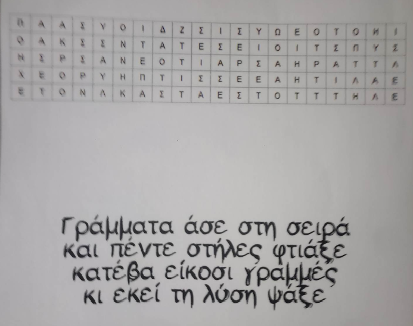

**Τι μας δίνουν:**
- Ένας πίνακας με γράμματα (5 σειρές x 20 στήλες)
- Οδηγίες σε στίχους:
  > "Γράμματα άσε στη σειρά
  > και πέντε στήλες φτιάξε
  > κατέβα είκοσι γραμμές
  > κι εκεί τη λύση ψάξε"

**Λογική επίλυσης:**

1. **Ανάγνωση γραμμάτων:** Διαβάζουμε τα γράμματα οριζόντια με τη σειρά:
   - ΠΑΑΣΥΟΙΔΖΣΙΣΥΩΕΟΤΟΗΙ...
   - (συνολικά 100 γράμματα)

2. **Αναδιάταξη:** Τοποθετούμε τα γράμματα σε **5 στήλες** και **20 σειρές** (100 ÷ 5 = 20)

3. **Ανάγνωση κάθετα:** Διαβάζουμε κάθε στήλη από πάνω προς τα κάτω

4. **Αποτέλεσμα:** Μια στήλη δίνει **ΠΕΡΙΣΤΕΡΙΩΝ**

**Απάντηση:** Οδός Περιστεριώνος

**Κατηγορία:** Cipher (Transposition/Columnar) + Wordplay

---

# 2024 - ΚΚΘ

---

## Γρίφος #1: Τα Τρία Μήλα (Πειρατική Ιστορία)

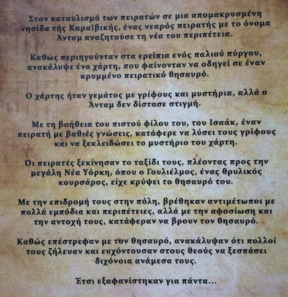

**Τι μας δίνουν:**
Μια πειρατική ιστορία με τρεις χαρακτήρες:
- **Άνταμ** (νεαρός πειρατής)
- **Ισαάκ** (φίλος του)
- **Γουλιέλμος** (θρυλικός κουρσάρος)

Η ιστορία μιλάει για Καραϊβική, Νέα Υόρκη, ερείπια πύργου, χάρτη θησαυρού, κλπ.

**Λογική επίλυσης:**

1. **Hint:** Τα ονόματα είναι τα σημαντικά στοιχεία!

2. **Αναγνώριση ονομάτων:**
   - **Άνταμ** → **Αδάμ** (Adam - Αδάμ & Εύα, Βίβλος)
   - **Ισαάκ** → **Ισαάκ Νεύτων** (Isaac Newton)
   - **Γουλιέλμος** → **Γουλιέλμος Τέλλος** (William Tell)

3. **Τι έχουν κοινό;** Και οι τρεις συνδέονται με **ΜΗΛΟ**!
   - **Αδάμ** → Το **μήλο** της Εύας (απαγορευμένος καρπός)
   - **Ισαάκ Νεύτων** → Το **μήλο** που έπεσε στο κεφάλι του (ανακάλυψη βαρύτητας)
   - **Γουλιέλμος Τέλλος** → Το **μήλο** στο κεφάλι του γιου του (τοξοβολία)

4. **Έλεγχος:** Υπάρχει **Οδός Μήλου** στη Νίκαια/Ρέντη; → ΝΑΙ!

**Απάντηση:** Οδός Μήλου

**Κατηγορία:** Trivia/Knowledge (Ιστορία + Μυθολογία) + Pattern Recognition

---

## Γρίφος #2: Τηλέφωνο Βενεζουέλας

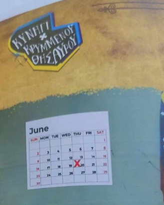

**Τι μας δίνουν:**
- Ένα ημερολόγιο με μαρκαρισμένη την **20 Ιουνίου**
- Ένα παλιό μαύρο τηλέφωνο πάνω σε ξύλινο τραπέζι
- Ένα χαρτί/σημειωματάριο δίπλα στο τηλέφωνο
- Μέρος σημαίας της **Βενεζουέλας** (κίτρινο-μπλε-κόκκινο με αστέρια)

**Λογική επίλυσης:**

1. **Αναγνώριση στοιχείων:**
   - Τηλέφωνο + Βενεζουέλα → σκεφτόμαστε **τηλεφωνικό κωδικό χώρας**
   - Ο κωδικός της Βενεζουέλας είναι **+58**

2. **Υπολογισμός:**
   - Ημερομηνία: **20 Ιουνίου**
   - Προσθέτουμε **58 ημέρες** στις 20 Ιουνίου
   - 20/6 + 58 ημέρες = **17 Αυγούστου**

3. **Έλεγχος:** Υπάρχει **Πλατεία 17ης Αυγούστου** στον Άγιο Ιωάννη Ρέντη; → ΝΑΙ!

**Απάντηση:** Πλατεία 17ης Αυγούστου (Άγιος Ιωάννης Ρέντης)

**Κατηγορία:** Trivia/Knowledge (Τηλεφωνικοί κωδικοί) + Math

---

# 2025 - SAFARI 1

---

## Γρίφος #1: Μαύρο Γάντι

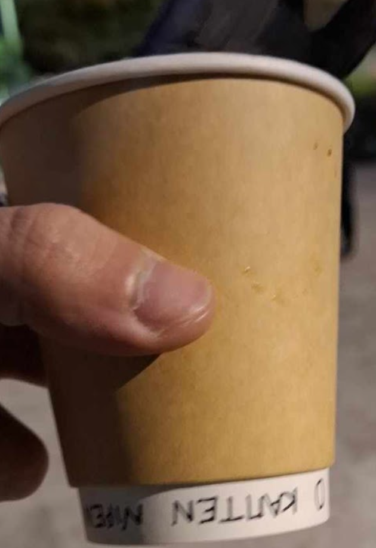

**Τι μας δίνουν:**
Καφέ χάρτινο ποτήρι καφέ με ένα μαύρο γάντι μέσα. Υπάρχει ένδειξη ότι πρέπει να το γυρίσουμε ανάποδα.

**Λογική επίλυσης:**

1. Το ποτήρι γυρίζει ανάποδα → σκεφτόμαστε ελληνικό καφέ και καφεμαντεία
2. Googlάρουμε "μαύρο γάντι καφεμαντεία" → το μαύρο γάντι συμβολίζει πρόκληση

**Απάντηση:** Πρόκληση

**Κατηγορία:** Physical + Trivia/Knowledge

---

## Γρίφος #2: Σησάχ & Atbash

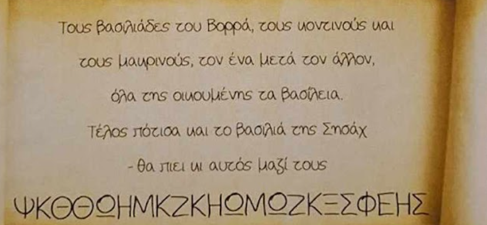

**Τι μας δίνουν:**
Ένα παλιό χαρτί/πάπυρος με κείμενο:

> Τους βασιλιάδες του Βορρά, τους γοντινούς και
> τους μαυρινούς, τον ένα μετά τον άλλον,
> όλα της οικουμένης τα βασίλεια.
> Τέλος πότισα και το βασιλιά της **Σησάχ**
> - θα πιει κι αυτός μαζί τους
>
> **ΨΚΘΘΩΗΜΚΖΚΗΜΩΖΚΞΣΦΕΗΣ**

**Λογική επίλυσης:**

1. **Trigger:** Η λέξη **"Σησάχ"** = Atbash cipher!
   - Στη Βίβλο, "Σησάχ" είναι ο Βαβυλώνιος βασιλιάς κρυπτογραφημένος με Atbash

2. **Εφαρμογή Atbash** στο κρυπτογραφημένο κείμενο:
   ```
   Ψ→Β  Κ→Ο  Θ→Ρ  Θ→Ρ  Ω→Α  Η→Σ  Μ→Ν  Κ→Ο  Ζ→Τ  Κ→Ο  Η→Σ
   Μ→Ν  Ω→Α  Ζ→Τ  Κ→Ο  Ξ→Λ  Σ→Η  Φ→Δ  Ε→Υ  Η→Σ  Σ→Η
   ```

3. **Αποτέλεσμα:** `ΒΟΡΡΑΣΝΟΤΟΣΑΝΑΤΟΛΗΔΥΣΗ`
   - ΒΟΡΡΑΣ - ΝΟΤΟΣ - ΑΝΑΤΟΛΗ - ΔΥΣΗ
   - Τα **4 σημεία του ορίζοντα**!

4. **Συμπέρασμα:** Αυτό δείχνει → **ΠΥΞΙΔΑ**

**Απάντηση:** Πυξίδα

**Κατηγορία:** Cipher (Atbash) + Trivia/Knowledge (Βιβλική αναφορά)

---

## Γρίφος #3: Αεροσκάφος ΑΓ.Ι.Ρ.

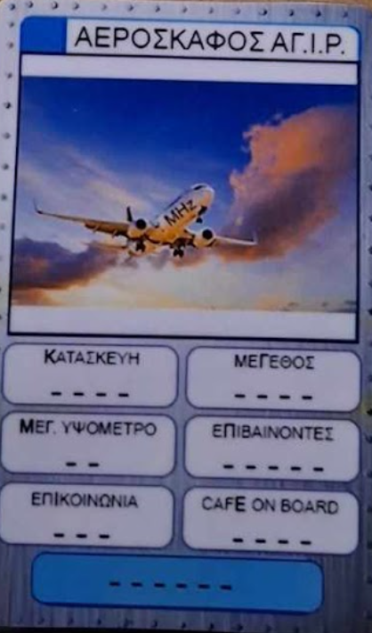

**Τι μας δίνουν:**
Μια κάρτα σαν "τεχνικά χαρακτηριστικά αεροσκάφους" με τίτλο **ΑΕΡΟΣΚΑΦΟΣ ΑΓ.Ι.Ρ.** και πεδία:
- **Κ**ΑΤΑΣΚΕΥΗ: ----
- ΜΕ**Γ**ΕΘΟΣ: ----
- **Μ**ΕΓ ΥΨΟΜΕΤΡΟ: --
- Ε**Π**ΙΒΑΙΝΟΝΤΕΣ: -----
- ΕΠ**Ι**ΚΟΙΝΩΝΙΑ: ---
- CAF**E** ON BOARD: -----

Στο αεροπλάνο φαίνεται η ένδειξη **MHz**.

**Λογική επίλυσης:**

1. **Αναγνώριση:** ΑΓ.Ι.Ρ. = **Άγιος Ιωάννης Ρέντης**

2. **Συμπλήρωση κάρτας** με στατιστικά του δήμου:
   - ΚΑΤΑΣΚΕΥΗ (Ίδρυση): **1897**
   - ΜΕΓΕΘΟΣ (Έκταση): **4524** (4,524 km²)
   - ΜΕΓ ΥΨΟΜΕΤΡΟ: **10** μέτρα
   - ΕΠΙΒΑΙΝΟΝΤΕΣ (Πληθυσμός): **15411**
   - ΕΠΙΚΟΙΝΩΝΙΑ (Τηλ. κωδικός): **210**
   - CAFE ON BOARD (Ταχ. κωδικός): **18200**

3. **Bold γράμματα = θέσεις ψηφίων:**
   | Πεδίο | Bold | Θέση | Τιμή | Ψηφίο |
   |-------|------|------|------|-------|
   | **Κ**ΑΤΑΣΚΕΥΗ | Κ | 1 | 1897 | **1** |
   | ΜΕ**Γ**ΕΘΟΣ | Γ | 3 | 4524 | **2** |
   | **Μ**ΕΓ ΥΨΟΜΕΤΡΟ | Μ | 1 | 10 | **1** |
   | Ε**Π**ΙΒΑΙΝΟΝΤΕΣ | Π | 2 | 15411 | **5** |
   | ΕΠ**Ι**ΚΟΙΝΩΝΙΑ | Ι | 3 | 210 | **0** |
   | CAF**E** | E | 4 | 18200 | **0** |

4. **6-ψήφιο νούμερο:** 1-2-1-5-0-0 = **121500**

5. **MHz hint:** 121.500 MHz = **International Air Distress frequency** (Emergency frequency)

6. **Συμπέρασμα:** Emergency = **ΚΙΝΔΥΝΟΣ**

**Απάντηση:** ΚΙΝΔΥΝΟΣ (→ αντιστοιχεί σε οδό μέσω ΟΔΩΝΥΜΙΟΥ)

**Κατηγορία:** Trivia/Knowledge (Στατιστικά δήμου + Αεροπορία) + Logic (Position extraction)

---

## Γρίφος #4: Vitamin C

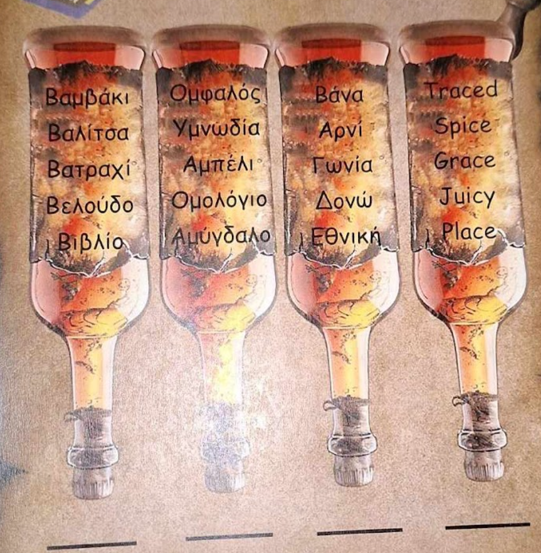

**Τι μας δίνουν:**
Μπουκάλια τοποθετημένα σε στήλες με γράμματα πάνω τους.

**Λογική επίλυσης:**

1. Βρίσκουμε τα κοινά γράμματα σε κάθε στήλη
2. Κοινά γράμματα: B, M, N, C
3. BMNC → Vitamin C
4. Vitamin C = Πορτοκάλι

**Απάντηση:** Πορτοκάλι

**Κατηγορία:** Logic

---

## Γρίφος #5: Numpad Drawing - NL

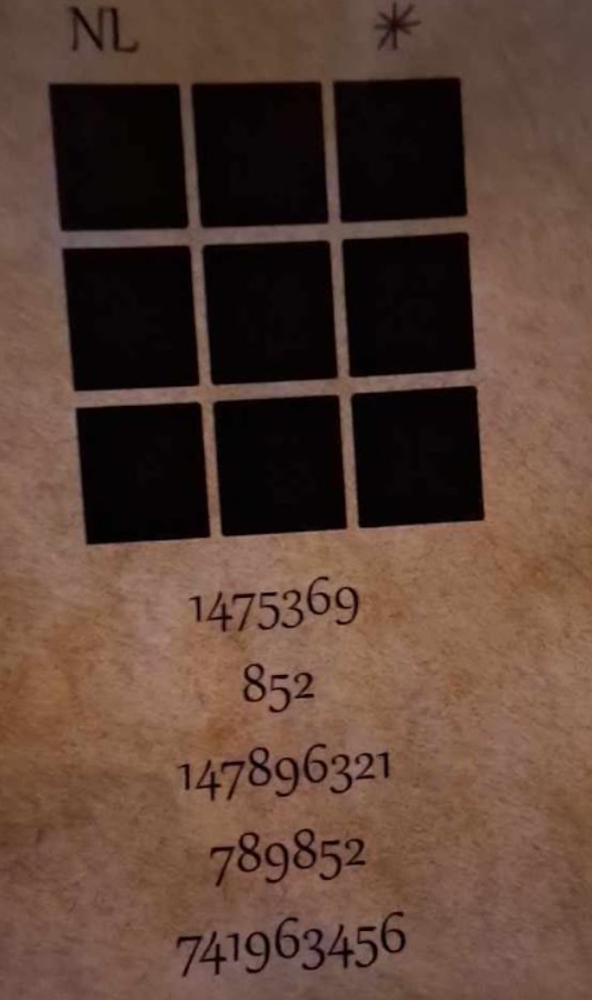

**Τι μας δίνουν:**
- **NL** πάνω αριστερά
- Ένα **3x3 grid** με 9 μαύρα τετράγωνα (σαν numpad τηλεφώνου)
- 5 σειρές αριθμών:
  - 1475369
  - 852
  - 147896321
  - 789852
  - 741963456

**Λογική επίλυσης:**

1. **Αναγνώριση:** Το 3x3 grid = **numpad τηλεφώνου**:
   ```
   7 8 9
   4 5 6
   1 2 3
   ```

2. **Μέθοδος:** Κάθε σειρά αριθμών = διαδρομή που **σχεδιάζει γράμμα** στο numpad

3. **Σχεδίαση γραμμάτων:**
   - **1475369** → σχηματίζει **Ν**
   - **852** → σχηματίζει **Ι** (κάθετη γραμμή)
   - **147896321** → σχηματίζει **Ο**
   - **789852** → σχηματίζει **Τ**
   - **741963456** → σχηματίζει **Η** και **Σ**

4. **Αποτέλεσμα:** **ΝΙΟΤΗΣ**

**Απάντηση:** ΝΙΟΤΗΣ (→ αντιστοιχεί σε οδό μέσω ΟΔΩΝΥΜΙΟΥ)

**Κατηγορία:** Visual + Logic (Numpad Drawing)

---

---

# 2025 - SAFARI 2

---

## Γρίφος #1: Πωλείται Διαμέρισμα

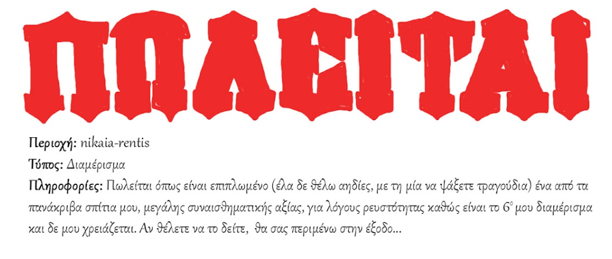

**Τι μας δίνουν:**
Μια αγγελία πώλησης με:
- Μεγάλη κόκκινη επιγραφή **"ΠΩΛΕΙΤΑΙ"**
- Περιοχή: **nikaia-rentis**
- Τύπος: **Διαμέρισμα**
- Πληροφορίες: "Πωλείται όπως είναι επιπλωμένο (έλα δε θέλω αηδίες, με τη μία να ψάξετε τραγούδια) ένα από τα πανάκριβα σπίτια μου, μεγάλης συναισθηματικής αξίας, για λόγους ρευστότητας καθώς είναι το **6ο** μου διαμέρισμα και δε μου χρειάζεται. Αν θέλετε να το δείτε, **θα σας περιμένω στην έξοδο**..."

**Λογική επίλυσης:**

1. **Κλειδί:** "6ο διαμέρισμα" + "nikaia-rentis"

2. **Google Search:** "6ο διαμέρισμα nikaia-rentis" → Βρίσκουμε αποτέλεσμα στην **Οδό Μεσολογγίου**

3. **Hint:** "θα σας περιμένω στην **έξοδο**" → **Έξοδος Μεσολογγίου** (ιστορικό γεγονός 1826)

4. **Συμπέρασμα:** ΕΞΟΔΟΣ (Μεσολογγίου) → λέξη ΟΔΩΝΥΜΙΟΥ

**Απάντηση:** ΕΞΟΔΟΣ (→ αντιστοιχεί σε οδό μέσω ΟΔΩΝΥΜΙΟΥ)

**Κατηγορία:** Trivia/Knowledge (Google Search + Ιστορία) + Wordplay

---

## Γρίφος #2: Μουσικές Νότες - 1η Μαρτίου

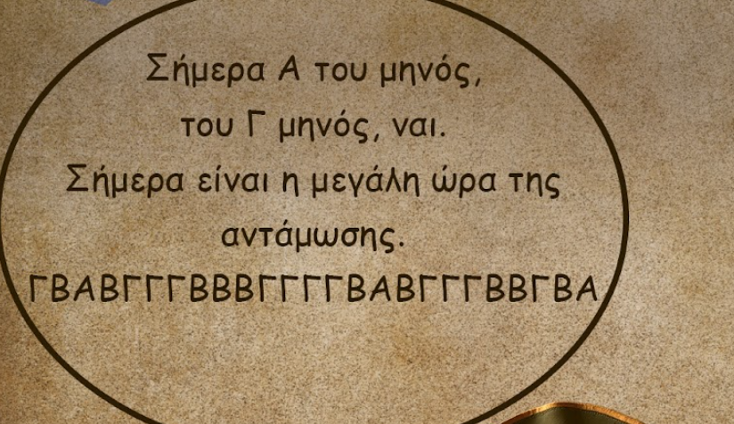

**Τι μας δίνουν:**
Ένα κυκλικό πλαίσιο με κείμενο:
> "Σήμερα Α του μηνός,
> του Γ μηνός, ναι.
> Σήμερα είναι η μεγάλη ώρα της
> αντάμωσης.
> **ΓΒΑΒΓΓΒΒΒΓΓΓΓΒΑΒΓΓΒΒΓΒΑ**"

**Λογική επίλυσης:**

1. **Αποκωδικοποίηση ημερομηνίας:**
   - "Α του μηνός" = **1η** (Α=1)
   - "του Γ μηνός" = **Μάρτιος** (Γ=3)
   - Ημερομηνία: **1η Μαρτίου**

2. **Κλειδί αντιστοίχισης:** Α=1, Β=2, Γ=3

3. **Μετατροπή γραμμάτων σε αριθμούς:**
   ```
   Γ Β Α Β Γ Γ Β Β Β Γ Γ Γ Γ Β Α Β Γ Γ Β Β Γ Β Α
   3 2 1 2 3 3 2 2 2 3 3 3 3 2 1 2 3 3 2 2 3 2 1
   ```

4. **Αριθμοί = Μουσικές νότες** (1=Do, 2=Re, 3=Mi ή αντίστοιχα)

5. **Παίζουμε τη μελωδία** → Αναγνωρίζουμε το τραγούδι **"Επεράσαμε Όμορφα"**

**Απάντηση:** ΕΠΕΡΑΣΑΜΕ (→ αντιστοιχεί σε οδό μέσω ΟΔΩΝΥΜΙΟΥ)

**Κατηγορία:** Cipher (Letters to Numbers) + Music Recognition

---

## Γρίφος #3: Nonogram - Περιμένω στην Ιταλία

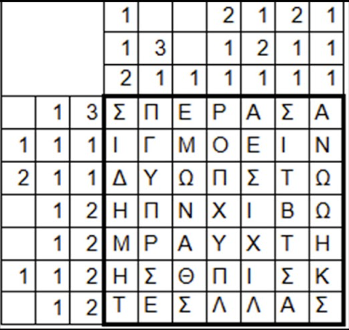

**Τι μας δίνουν:**
- Ένα **Nonogram** puzzle με αριθμούς στο πάνω και αριστερό μέρος
- Κάτω από το nonogram: πίνακας με **ελληνικά γράμματα** 7x7:
  ```
  Σ Π Ε Ρ Α Σ Α
  Ι Γ Μ Ο Ε Ι Ν
  Δ Υ Ω Π Σ Τ Ω
  Η Π Ν Χ Ι Β Ω
  Μ Ρ Α Υ Χ Τ Η
  Η Σ Θ Π Ι Σ Κ
  Τ Ε Σ Λ Λ Α Σ
  ```

**Λογική επίλυσης:**

1. **Λύνουμε το Nonogram** - βρίσκουμε ποια κελιά είναι μαύρα και ποια άσπρα

2. **ΣΗΜΑΝΤΙΚΟ:** Σε αυτόν τον γρίφο, διαβάζουμε τα **ΑΣΠΡΑ** κελιά (όχι τα μαύρα!)

3. **Τα άσπρα κελιά** αντιστοιχούν σε γράμματα που σχηματίζουν: **"ΠΕΡΙΜΕΝΩ ΣΤΗΝ ΧΩΡΑ ΤΗΣ ΠΙΤΣΑΣ"**

4. **Ερμηνεία:** Χώρα της πίτσας = **ΙΤΑΛΙΑ**

**Απάντηση:** ΙΤΑΛΙΑ (→ αντιστοιχεί σε οδό μέσω ΟΔΩΝΥΜΙΟΥ)

**Κατηγορία:** Logic (Nonogram) + Cipher (Grid Letters) + Trivia/Knowledge

**Σημείωση:** Όταν υπάρχουν 2 επιλογές (μαύρο/άσπρο, γεμάτο/κενό, 0/1), ΠΑΝΤΑ δοκίμασε ΚΑΙ ΤΑ ΔΥΟ!

---

## Γρίφος #4: ATM της Αναλήψεως

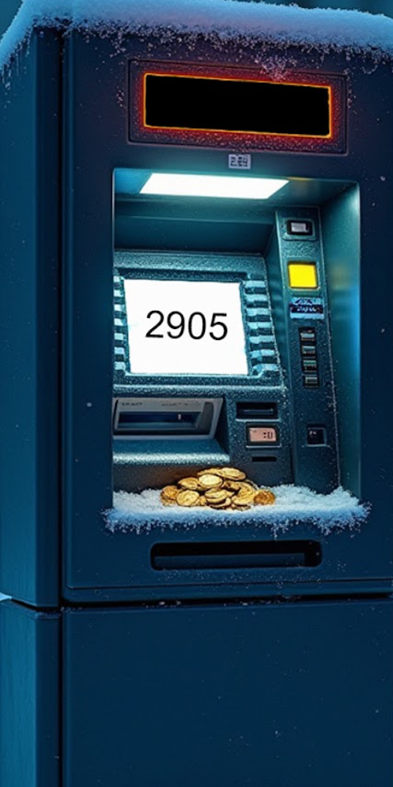

**Τι μας δίνουν:**
- Εικόνα με **ATM** καλυμμένο με χιόνι/πάγο
- Στην οθόνη του ATM: **2905**
- Χρυσά νομίσματα γύρω από το ATM

**Λογική επίλυσης:**

1. **ATM** = μηχάνημα για **ΑΝΑΛΗΨΗ** χρημάτων

2. **2905** = Ημερομηνία **29/05** (29 Μαΐου)

3. **29 Μαΐου** = **Ημέρα της Αναλήψεως** (Ανάληψη του Χριστού - θρησκευτική εορτή)

4. **Wordplay:** Η λέξη "ΑΝΑΛΗΨΗ" έχει διπλή σημασία:
   - Ανάληψη χρημάτων (από ATM)
   - Ανάληψη του Χριστού (θρησκευτική)

**Απάντηση:** ΑΝΑΛΗΨΗ (→ αντιστοιχεί σε οδό μέσω ΟΔΩΝΥΜΙΟΥ)

**Κατηγορία:** Wordplay (Διπλή σημασία) + Date/Number Pattern

**Σημείωση:** Όταν βλέπεις αριθμούς 4ψήφιους (ΗΜΜΜ ή ΜΜΗΗ), σκέψου αν είναι **ημερομηνία** και ψάξε τι γιορτάζεται εκείνη την ημέρα!

---
